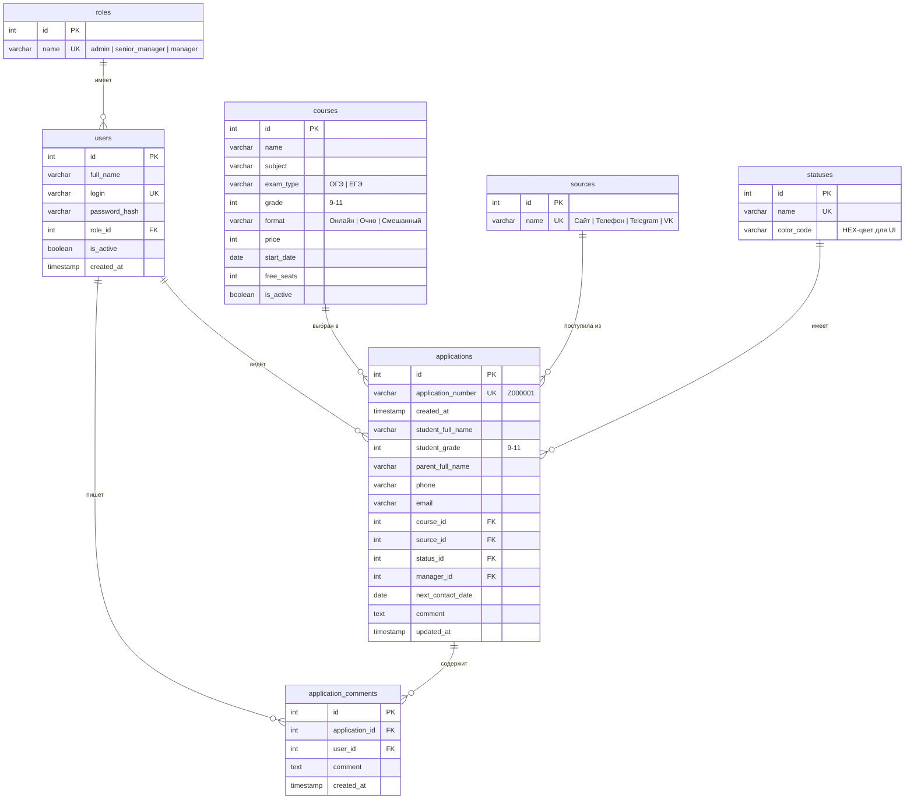

# ER-диаграмма базы данных Umax CRM

База данных спроектирована в **3-й нормальной форме (3НФ)**. Каждая сущность хранится в отдельной таблице, связи реализованы через внешние ключи.

## Диаграмма

## Описание сущностей

| Таблица | Назначение |
|---------|-----------|
| **roles** | Справочник ролей пользователей системы |
| **users** | Менеджеры и администраторы CRM |
| **sources** | Источники поступления заявок |
| **statuses** | Статусы обработки заявок с цветовой индикацией |
| **courses** | Каталог курсов подготовки к ОГЭ/ЕГЭ |
| **applications** | Заявки от родителей и учеников |
| **application_comments** | История комментариев к заявкам |

## Связи

- `users.role_id` → `roles.id` — каждый пользователь имеет одну роль
- `applications.course_id` → `courses.id` — заявка привязана к курсу
- `applications.source_id` → `sources.id` — источник заявки
- `applications.status_id` → `statuses.id` — текущий статус
- `applications.manager_id` → `users.id` — ответственный менеджер
- `application_comments.application_id` → `applications.id` — комментарий к заявке
- `application_comments.user_id` → `users.id` — автор комментария

## Цветовая индикация статусов

| Статус | Цвет | HEX |
|--------|------|-----|
| Новая | Светло-синий | `#e3f2fd` |
| В работе | Светло-оранжевый | `#fff3e0` |
| Ожидает звонка | Жёлтый | `#fff9c4` |
| Записан на курс | Зелёный | `#c8e6c9` |
| Отказ | Серый | `#eeeeee` |
| Просрочена | Красный | `#ffebee` |

## SQL-скрипт

Полный скрипт создания таблиц: [`backend/create_db.sql`](../backend/create_db.sql)
